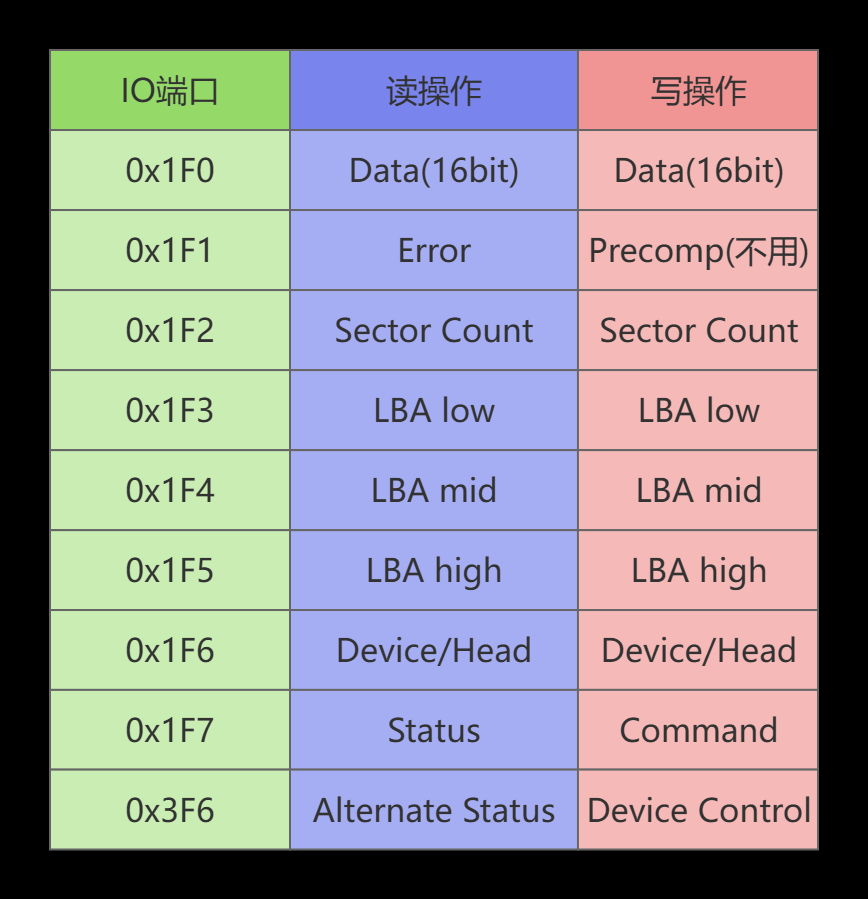
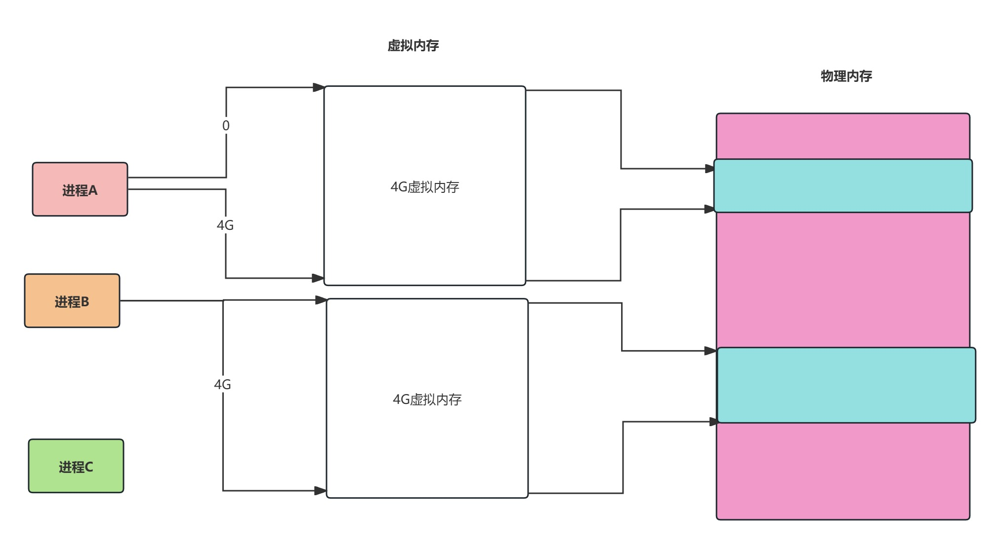
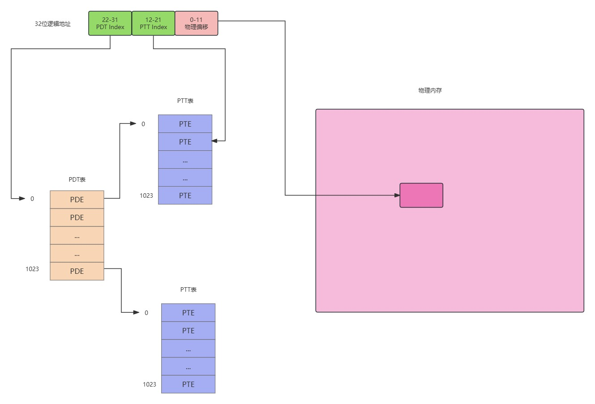

# my-x86-os
手写x86

# 整体架构图 

# 硬盘寄存器的端口

# 

# 零碎知识点
## 1.0x1F2:

在内核或操作系统开发中，地址0x1F2通常和"IDE/ATA硬盘端口(I/O端口)"有关。它不是一个普通的内存地址，而是一个I/O端口地址，
专用于和硬盘控制器通信

## 2.0x10
清除屏幕内容
## 3.0x13
用于磁盘读写

## 4.[ORG 0x7C00]
这是BIOS加载到MBR到内存的标准地址

## 5.虚拟地址到物理内存地址的映射架构图

